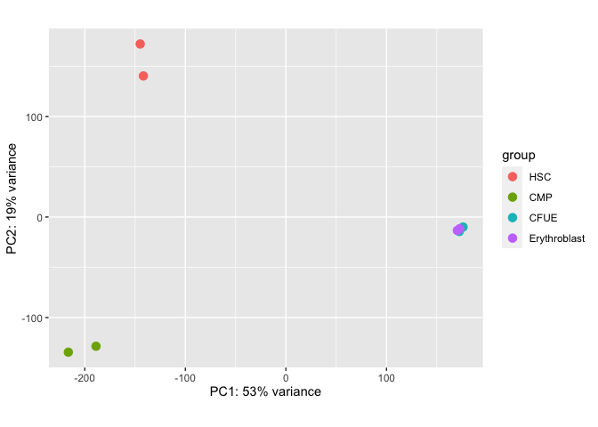
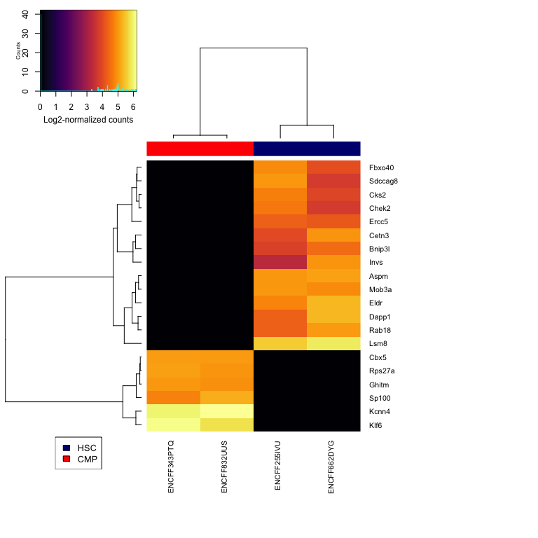
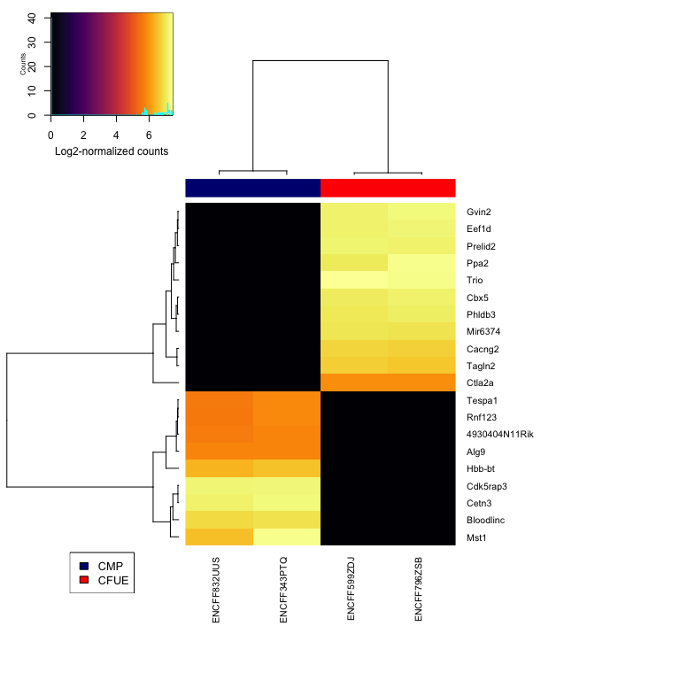

STAT555 Project : ATAC-Seq Analysis
================
Avantika Diwadkar
4/20/2022

### Libraries

``` r
library(GenomicRanges)
library(dplyr)
library(tidyr)
library(DESeq2)
library(BSgenome.Mmusculus.UCSC.mm10)
#library(tracktables)
library(clusterProfiler)
library(ChIPseeker)
library(TxDb.Mmusculus.UCSC.mm10.knownGene)
library(biomaRt)
mart <- useMart(biomart='ENSEMBL_MART_ENSEMBL',dataset='mmusculus_gene_ensembl')
library(gplots)
library(viridis)
library(DT)
```

### Read in the sample info file created

Tutorial:
<https://rockefelleruniversity.github.io/RU_ATAC_Workshop.html>

3 pairs of cell lines (1=HSC, 2=CMP, 3=CFUE, 4=Erythroblast)

Compare: 24,12,23 =&gt; CMP vs Erythroblast, HSC vs CMP, CMP vs CFUE

5.  What regions have differential chromatin patterns across each pair
    of cell lines? What are the genes near these regions?
6.  How are differential chromatin patterns related to the expression
    patterns of nearby genes?
7.  What are the functions of the genes with differential chromatin
    patterns?
8.  Construct a hierarchical tree using all the ATAC-seq data and use
    clustering analysis to explore the pattern of cell-line specified
    genes. Do you get the same structure as the tree from RNA-seq data?

## Read in sample data

``` r
sample_info <- read.csv("atac_seq_sample_sheet.csv")
```

## Read in consensus (merged) peak intensity files generated with convert\_atac\_seq.sh script

``` r
# List of file prefixes
fileNames <- c("ENCFF181AMY","ENCFF255IVU","ENCFF343PTQ","ENCFF599ZDJ",
"ENCFF616EWK","ENCFF662DYG","ENCFF796ZSB", "ENCFF832UUS")

# The peak identities
peakNames <- read.csv(paste0(fileNames[1], ".master_peak_list.bigbedfile1.pkidsort.tab"),  sep="\t")[,1]

# Get column 6 from each of the files
cols <- c()
 for (file in fileNames){
   cols <- cbind(cols, read.csv(paste0(file, ".master_peak_list.bigbedfile1.pkidsort.tab"),  sep="\t")[,6])
 }
```

``` r
# Turn it into a data frame and add row names and column names
all <- data.frame(cols, row.names = peakNames)
colnames(all) <- fileNames

#Re-order columns and convert to integer
myCounts <- all[,as.vector(sample_info$Sample)] %>% mutate_if(is.numeric, round)
Group <- factor(as.vector(sample_info$Condition))

#View
head(myCounts)
```

    ##                           ENCFF662DYG ENCFF255IVU ENCFF832UUS ENCFF343PTQ
    ## chr10_100014895_100015045           0           0           0           4
    ## chr10_100015422_100016135           4           7           5           8
    ## chr10_100016150_100016380           8          12          23          18
    ## chr10_100016484_100016707           6          10           6          10
    ## chr10_100016944_100017094           0           0           3           0
    ## chr10_100030961_100031111           0           0           0           4
    ##                           ENCFF796ZSB ENCFF599ZDJ ENCFF181AMY ENCFF616EWK
    ## chr10_100014895_100015045           0           0           0           0
    ## chr10_100015422_100016135           0           0           0           0
    ## chr10_100016150_100016380           0           0           0           0
    ## chr10_100016484_100016707           0           0           0           0
    ## chr10_100016944_100017094           0           0           0           0
    ## chr10_100030961_100031111           0           0           0           0

## Differential ATAC-Seq analysis

The presense or absense of a peak does not fully capture the changes in
ATAC-seq signal. Identifying changes in signal within peaks will allow
us to better capture ATAC-seq signal differences across the celltypes.

### DESEQ2 Analysis

``` r
#Set Group
metaData <- data.frame(Group, row.names = colnames(myCounts))
metaData$Group <- factor(metaData$Group, levels = c("HSC","CMP","CFUE","Erythroblast")) #set order 

atacDDS_table <- DESeqDataSetFromMatrix(myCounts, metaData, ~Group) #rowRanges = consensusToCount
atacDDS <- DESeq(atacDDS_table)

#normalized counts
atacDDS_count <- counts(atacDDS, normalize=T)
```

### PCA Plot

``` r
atac_Rlog <- rlog(atacDDS)
plotPCA(atac_Rlog, intgroup = "Group", ntop = nrow(atac_Rlog))
```

<!-- -->

### CMP vs Erythroblasts : comparison 1

``` r
cell1 <- "CMP"
cell2 <- "Erythroblast"

ErythroMinusCMP <- results(atacDDS, c("Group", cell2 , cell1), format = "DataFrame") #CMP is the control base tissue similar to RNASeq
ErythroMinusCMP$peaks <- row.names(ErythroMinusCMP) 
ErythroMinusCMP <- ErythroMinusCMP[order(ErythroMinusCMP$pvalue),]
```

### Annotation of differential regions for comparison 1

``` r
#Convert to GRanges
ErythroMinusCMPGR <- makeGRangesFromDataFrame(as.data.frame(ErythroMinusCMP) %>% separate(peaks, c("Chr", "Start", "Stop")),keep.extra.columns=TRUE)

#Annotate peaks
anno_ErythroMinusCMP <- annotatePeak(ErythroMinusCMPGR, TxDb = TxDb.Mmusculus.UCSC.mm10.knownGene)
```

    ## >> preparing features information...      2022-04-21 23:37:06 
    ## >> identifying nearest features...        2022-04-21 23:37:08 
    ## >> calculating distance from peak to TSS...   2022-04-21 23:37:16 
    ## >> assigning genomic annotation...        2022-04-21 23:37:16 
    ## >> assigning chromosome lengths           2022-04-21 23:37:55 
    ## >> done...                    2022-04-21 23:37:55

### Get gene symbol for transcript ID

``` r
anno_ErythroMinusCMP_df <- as.data.frame(as.GRanges(anno_ErythroMinusCMP))
anno_ErythroMinusCMP_df$Gene <- sapply(strsplit(as.character(anno_ErythroMinusCMP_df$transcriptId), '\\.'), '[[', 1)

#Assign symbols with biomart
#mart <- useEnsembl(biomart='ENSEMBL_MART_ENSEMBL',dataset='mmusculus_gene_ensembl',mirror = "useast")
genes <- biomaRt::getBM(attribute=c('ensembl_transcript_id', 'mgi_symbol'), values=anno_ErythroMinusCMP_df$Gene, mart=mart,useCache = FALSE)
genes <- genes[!duplicated(genes$ensembl_transcript_id),]

#Merge with count data
anno_ErythroMinusCMP_df <- merge(anno_ErythroMinusCMP_df, genes, by.x="Gene", by.y="ensembl_transcript_id") %>% dplyr::rename("gene_symbol"="mgi_symbol")
anno_ErythroMinusCMP_df$gene_symbol[which(anno_ErythroMinusCMP_df$gene_symbol=='')] <- NA
```

### Final results

``` r
#Filter by significance, distance to TSS and FC
ErythroMinusCMP_results <- anno_ErythroMinusCMP_df %>% dplyr::filter(pvalue < 0.05, abs(distanceToTSS) < 5000, abs(log2FoldChange) > 0) %>% dplyr::arrange(pvalue)

#Add peaks
ErythroMinusCMP_results$Peak <- as.character(paste0(ErythroMinusCMP_results$seqnames,"_",ErythroMinusCMP_results$start,"_",ErythroMinusCMP_results$end))

#Save results
write.csv2(ErythroMinusCMP_results, "ErythrovsCMP_atacseq_sigpval_5kb_logFC.tab", row.names=F,quote = F, sep = "\t")
```

### Heatmap

``` r
make_heatmap <- function(df, coldata){
    
  #Log2 of counts
  norm_counts = log2(atacDDS_count+1)
  mat <- norm_counts[, row.names(coldata)]
  
  #Top 50 genes
  top.mat <- mat[rownames(mat)%in%df[1:20,"Peak"],] 
  array_name <- colnames(mat)
  gene_symbol=df[1:20,"gene_symbol"]
  
  #assign colors
  colour_status <- c("navy","red")
  names(colour_status) <- as.vector(unique(coldata$Group))
  colour_status_list <- unlist(lapply(as.vector(coldata$Group),function(x){colour_status[x]}))
  
  #Make heatmap
  heatmap.2(na.omit(top.mat), col=viridis(256, option="B"),
    ColSideColors=colour_status_list, #use list of assigned colors
    labCol=array_name, labRow=gene_symbol, 
    trace="none",
    margins=c(12,20), 
    cexRow=1,cexCol=1,
    keysize=1.5,key.title=NA,key.xlab="Log2-normalized counts",key.ylab="Counts",
    main="")
  legend("bottomleft",legend=names(colour_status),fill=colour_status,cex=0.8) #use list of assigned colors
}
```

``` r
#Filter data for cell types
coldata <- metaData %>% dplyr::filter(Group %in% c(cell1,cell2))
make_heatmap(ErythroMinusCMP_results, coldata)
```

<!-- --> \#\#\# GO
Enrichment

``` r
go1 <- enrichGO(as.data.frame(as.GRanges(anno_ErythroMinusCMP)[as.GRanges(anno_ErythroMinusCMP)$log2FoldChange > 0])$geneId, OrgDb = "org.Mm.eg.db", ont = "BP", maxGSSize = 5000)

head(go1, 10) %>% dplyr::select(ID, Description, pvalue, p.adjust) %>% datatable(elementId = "goEle1")
```

<div id="goEle1" style="width:100%;height:auto;" class="datatables html-widget"></div>
<script type="application/json" data-for="goEle1">{"x":{"filter":"none","vertical":false,"data":[["GO:0006996","GO:0046483","GO:0006725","GO:0006139","GO:1901360","GO:1901576","GO:0044249","GO:0090304","GO:0044267","GO:0043412"],["GO:0006996","GO:0046483","GO:0006725","GO:0006139","GO:1901360","GO:1901576","GO:0044249","GO:0090304","GO:0044267","GO:0043412"],["organelle organization","heterocycle metabolic process","cellular aromatic compound metabolic process","nucleobase-containing compound metabolic process","organic cyclic compound metabolic process","organic substance biosynthetic process","cellular biosynthetic process","nucleic acid metabolic process","cellular protein metabolic process","macromolecule modification"],[1.16451356123074e-205,1.27782613296952e-205,5.4041928868491e-203,3.91643200117445e-201,9.24880000576874e-201,6.48200243005086e-200,5.67873333169112e-197,7.40094457614943e-181,1.66594445298909e-176,3.2316783521938e-163],[4.31521885103806e-202,4.31521885103806e-202,1.21666395859263e-199,6.61289543398306e-198,1.24932790477924e-197,7.29657406876059e-197,5.47916641746312e-194,6.24824745841416e-178,1.2501987594987e-173,2.18267555907169e-160]],"container":"<table class=\"display\">\n  <thead>\n    <tr>\n      <th> <\/th>\n      <th>ID<\/th>\n      <th>Description<\/th>\n      <th>pvalue<\/th>\n      <th>p.adjust<\/th>\n    <\/tr>\n  <\/thead>\n<\/table>","options":{"columnDefs":[{"className":"dt-right","targets":[3,4]},{"orderable":false,"targets":0}],"order":[],"autoWidth":false,"orderClasses":false}},"evals":[],"jsHooks":[]}</script>

------------------------------------------------------------------------

## HSC vs CMP : comparison 2

``` r
cell1 <- "HSC"
cell2 <- "CMP"

CMPMinusHSC <- results(atacDDS, c("Group", cell2 , cell1), format = "DataFrame") #HSC is control baseline
CMPMinusHSC$peaks <- row.names(CMPMinusHSC) 
CMPMinusHSC <- CMPMinusHSC[order(CMPMinusHSC$pvalue),]
```

### Annotation of differential regions for comparison 2

``` r
#Convert to GRanges
CMPMinusHSCGR <- makeGRangesFromDataFrame(as.data.frame(CMPMinusHSC) %>% separate(peaks, c("Chr", "Start", "Stop")),keep.extra.columns=TRUE)

#Annotate peaks
anno_CMPMinusHSC <- annotatePeak(CMPMinusHSCGR, TxDb = TxDb.Mmusculus.UCSC.mm10.knownGene)
```

    ## >> preparing features information...      2022-04-21 23:40:39 
    ## >> identifying nearest features...        2022-04-21 23:40:39 
    ## >> calculating distance from peak to TSS...   2022-04-21 23:40:50 
    ## >> assigning genomic annotation...        2022-04-21 23:40:50 
    ## >> assigning chromosome lengths           2022-04-21 23:40:56 
    ## >> done...                    2022-04-21 23:40:56

### Get gene symbol for transcript ID

``` r
anno_CMPMinusHSC_df <- as.data.frame(as.GRanges(anno_CMPMinusHSC))
anno_CMPMinusHSC_df$Gene <- sapply(strsplit(as.character(anno_CMPMinusHSC_df$transcriptId), '\\.'), '[[', 1)

#Assign symbols with biomart
#mart <- useEnsembl(biomart='ENSEMBL_MART_ENSEMBL',dataset='mmusculus_gene_ensembl',mirror = "useast")
genes <- biomaRt::getBM(attribute=c('ensembl_transcript_id', 'mgi_symbol'), values=anno_CMPMinusHSC_df$Gene, mart=mart,useCache = FALSE)
genes <- genes[!duplicated(genes$ensembl_transcript_id),]

#Merge with count data
anno_CMPMinusHSC_df <- merge(anno_CMPMinusHSC_df, genes, by.x="Gene", by.y="ensembl_transcript_id") %>% dplyr::rename("gene_symbol"="mgi_symbol")
anno_CMPMinusHSC_df$gene_symbol[which(anno_CMPMinusHSC_df$gene_symbol=='')] <- NA
```

### Final results

``` r
#Filter by significance, distance to TSS and FC
CMPMinusHSC_results <- anno_CMPMinusHSC_df %>% dplyr::filter(pvalue < 0.05, abs(distanceToTSS) < 5000, abs(log2FoldChange) > 0) %>% dplyr::arrange(pvalue)

#Add peaks
CMPMinusHSC_results$Peak <- as.character(paste0(CMPMinusHSC_results$seqnames,"_",CMPMinusHSC_results$start,"_",CMPMinusHSC_results$end))

#Save results
write.csv2(CMPMinusHSC_results, "CMPvsHSC_atacseq_sigpval_5kb_logFC.tab", row.names=F,quote = F,
          sep="\t")
```

### Heatmap

``` r
#Filter data for cell types
coldata <- metaData %>% dplyr::filter(Group %in% c(cell1,cell2))
make_heatmap(CMPMinusHSC_results, coldata)
```

<!-- -->

### GO Enrichment

``` r
go2 <- enrichGO(as.data.frame(as.GRanges(anno_CMPMinusHSC)[as.GRanges(anno_CMPMinusHSC)$log2FoldChange > 0])$geneId, OrgDb = "org.Mm.eg.db", ont = "BP", maxGSSize = 5000)

head(go2, 10) %>% dplyr::select(ID, Description, pvalue, p.adjust) %>% datatable(elementId = "goEle1")
```

<div id="goEle1" style="width:100%;height:auto;" class="datatables html-widget"></div>
<script type="application/json" data-for="goEle1">{"x":{"filter":"none","vertical":false,"data":[["GO:1901576","GO:1901360","GO:0044249","GO:0046483","GO:0048523","GO:0006725","GO:0006139","GO:0009893","GO:0048731","GO:0090304"],["GO:1901576","GO:1901360","GO:0044249","GO:0046483","GO:0048523","GO:0006725","GO:0006139","GO:0009893","GO:0048731","GO:0090304"],["organic substance biosynthetic process","organic cyclic compound metabolic process","cellular biosynthetic process","heterocycle metabolic process","negative regulation of cellular process","cellular aromatic compound metabolic process","nucleobase-containing compound metabolic process","positive regulation of metabolic process","system development","nucleic acid metabolic process"],[1.90535883020146e-253,2.18488239962365e-250,1.19642898388024e-249,2.24123601205949e-249,2.4358296964531e-249,3.49359197301162e-249,2.46034646427123e-242,7.12191696518539e-226,1.87846070097108e-221,3.03966391955892e-218],[1.28687935391807e-249,7.37834786352908e-247,2.69356045237572e-246,3.29031875396885e-246,3.29031875396885e-246,3.93262003095341e-246,2.37388285995541e-239,6.01267839785777e-223,1.40968039715096e-218,2.0529890112701e-215]],"container":"<table class=\"display\">\n  <thead>\n    <tr>\n      <th> <\/th>\n      <th>ID<\/th>\n      <th>Description<\/th>\n      <th>pvalue<\/th>\n      <th>p.adjust<\/th>\n    <\/tr>\n  <\/thead>\n<\/table>","options":{"columnDefs":[{"className":"dt-right","targets":[3,4]},{"orderable":false,"targets":0}],"order":[],"autoWidth":false,"orderClasses":false}},"evals":[],"jsHooks":[]}</script>

------------------------------------------------------------------------

### CMP vs CFUE : comparison 3

``` r
cell1 <- "CMP"
cell2 <- "CFUE"

CFUEMinusCMP <- results(atacDDS, c("Group", cell2 , cell1), format = "DataFrame") #CMP is control baseline
CFUEMinusCMP$peaks <- row.names(CFUEMinusCMP) 
CFUEMinusCMP <- CFUEMinusCMP[order(CFUEMinusCMP$pvalue),]
```

### Annotation of differential regions for comparison 2

``` r
#Convert to GRanges
CFUEMinusCMPGR <- makeGRangesFromDataFrame(as.data.frame(CFUEMinusCMP) %>% separate(peaks, c("Chr", "Start", "Stop")),keep.extra.columns=TRUE)

#Annotate peaks
anno_CFUEMinusCMP <- annotatePeak(CFUEMinusCMPGR, TxDb = TxDb.Mmusculus.UCSC.mm10.knownGene)
```

    ## >> preparing features information...      2022-04-21 23:43:02 
    ## >> identifying nearest features...        2022-04-21 23:43:02 
    ## >> calculating distance from peak to TSS...   2022-04-21 23:43:11 
    ## >> assigning genomic annotation...        2022-04-21 23:43:11 
    ## >> assigning chromosome lengths           2022-04-21 23:43:17 
    ## >> done...                    2022-04-21 23:43:17

### Get gene symbol for transcript ID

``` r
anno_CFUEMinusCMP_df <- as.data.frame(as.GRanges(anno_CFUEMinusCMP))
anno_CFUEMinusCMP_df$Gene <- sapply(strsplit(as.character(anno_CFUEMinusCMP_df$transcriptId), '\\.'), '[[', 1)

#Assign symbols with biomart
#mart <- useEnsembl(biomart='ENSEMBL_MART_ENSEMBL',dataset='mmusculus_gene_ensembl',mirror = "useast")
genes <- biomaRt::getBM(attribute=c('ensembl_transcript_id', 'mgi_symbol'), values=anno_CFUEMinusCMP_df$Gene, mart=mart,useCache = FALSE)
genes <- genes[!duplicated(genes$ensembl_transcript_id),]

#Merge with count data
anno_CFUEMinusCMP_df <- merge(anno_CFUEMinusCMP_df, genes, by.x="Gene", by.y="ensembl_transcript_id") %>% dplyr::rename("gene_symbol"="mgi_symbol")
anno_CFUEMinusCMP_df$gene_symbol[which(anno_CFUEMinusCMP_df$gene_symbol=='')] <- NA
```

### Final results

``` r
#Filter by significance, distance to TSS and FC
CFUEMinusCMP_results <- anno_CFUEMinusCMP_df %>% dplyr::filter(pvalue < 0.05, abs(distanceToTSS) < 5000, abs(log2FoldChange) > 0) %>% dplyr::arrange(pvalue)

#Add peaks
CFUEMinusCMP_results$Peak <- as.character(paste0(CFUEMinusCMP_results$seqnames,"_",CFUEMinusCMP_results$start,"_",CFUEMinusCMP_results$end))

#Save results
write.csv2(CFUEMinusCMP_results, "CFUEvsCMP_atacseq_sigpval_5kb_logFC.tab", row.names=F,quote = F, sep="\t")
```

## Heatmap

``` r
#Filter data for cell types
coldata <- metaData %>% dplyr::filter(Group %in% c(cell1,cell2))
make_heatmap(CFUEMinusCMP_results, coldata)
```

<!-- -->

### GO Enrichment

``` r
go3 <- enrichGO(as.data.frame(as.GRanges(anno_CFUEMinusCMP)[as.GRanges(anno_CFUEMinusCMP)$log2FoldChange > 0])$geneId, OrgDb = "org.Mm.eg.db", ont = "BP", maxGSSize = 5000)

head(go3, 10) %>% dplyr::select(ID, Description, pvalue, p.adjust) %>% datatable(elementId = "goEle1")
```

<div id="goEle1" style="width:100%;height:auto;" class="datatables html-widget"></div>
<script type="application/json" data-for="goEle1">{"x":{"filter":"none","vertical":false,"data":[["GO:0046483","GO:0006725","GO:1901360","GO:0006139","GO:1901576","GO:0044249","GO:0006996","GO:0090304","GO:0044267","GO:0048523"],["GO:0046483","GO:0006725","GO:1901360","GO:0006139","GO:1901576","GO:0044249","GO:0006996","GO:0090304","GO:0044267","GO:0048523"],["heterocycle metabolic process","cellular aromatic compound metabolic process","organic cyclic compound metabolic process","nucleobase-containing compound metabolic process","organic substance biosynthetic process","cellular biosynthetic process","organelle organization","nucleic acid metabolic process","cellular protein metabolic process","negative regulation of cellular process"],[1.92795818818727e-217,6.6375391838646e-217,2.06027650395813e-216,5.50520011826815e-210,9.61136615719179e-208,1.41576224189501e-203,3.11899207802894e-198,4.44108471861562e-193,1.61955529205123e-183,1.75498049103597e-182],[1.30214296030168e-213,2.24149698239108e-213,4.63836916924441e-213,9.29553039969578e-207,1.29830334051347e-204,1.59367636362648e-200,3.00938178500106e-195,3.74938577369123e-190,1.21538627139045e-180,1.1853138236457e-179]],"container":"<table class=\"display\">\n  <thead>\n    <tr>\n      <th> <\/th>\n      <th>ID<\/th>\n      <th>Description<\/th>\n      <th>pvalue<\/th>\n      <th>p.adjust<\/th>\n    <\/tr>\n  <\/thead>\n<\/table>","options":{"columnDefs":[{"className":"dt-right","targets":[3,4]},{"orderable":false,"targets":0}],"order":[],"autoWidth":false,"orderClasses":false}},"evals":[],"jsHooks":[]}</script>
